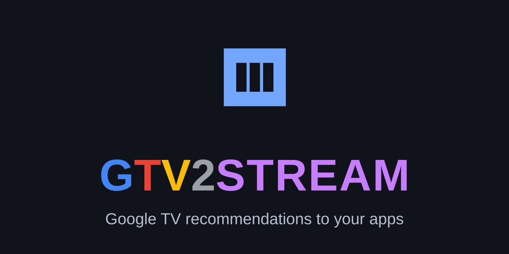

# GTV2STREAM



GTV2STREAM is a small, independent Android TV companion that redirects a selected Google TV launcher recommendation to your chosen app. Film and series titles open in Nuvio or Stremio; YouTube cards open as a title search in SmartTube. It does not host, stream, or provide media.

## Install

- **[Install via ADB on Windows](INSTALL_ADB.md)**
- **[Roadmap: supported, in progress, planned](ROADMAP.md)**

ADB installation is required. It installs the APK and applies the accessibility
service setup needed on TVs that restrict sideloaded accessibility apps.

## Behavior

The accessibility service accepts only these events from the Google TV `launcherx` package:

- `TYPE_VIEW_CLICKED`: reads a credible title directly from the event text/content description.
- `TYPE_WINDOW_STATE_CHANGED`: when the entity activity appears, reads the stable `entity_details_title_row` view ID.

If the title row is not ready, the service retries against a fresh accessibility tree after 250 ms, with a final attempt at 600 ms. It fails closed for UI chrome, metadata-only cards, advertisements, and sponsored cards. Titles are deduplicated within a short event window; no accessibility node is retained across events. The launcher's full UI vocabulary is excluded — navigation tabs, row labels, the quick-settings sheet, device-preferences tree, edit-mode verbs, toggle labels, input/port labels, and price actions — so a UI element whose label coincides with a real film title is never opened; fail-closed wins over the rare title miss.

Provider payload handling is shape-based and provider-agnostic: action suffixes ("Watch on", "Watch Now on", "Stream on", "Streaming on", "New on", "Included with") are stripped, and a known provider name in a leading or trailing segment position is recognized across period, comma, bullet, and dash separators (e.g. "Title. Watch on Paramount+.", "Netflix. Title.", "Title, Disney+", "Title — Prime Video"). Provider names never leak into a returned title.

### Targets

**TV & movies target** (Nuvio by default, or Stremio): a matching title is looked up through TMDB `/3/search/multi`, with optional year-aware matching. The result's IMDb identifier is then sent to the selected target using exactly:

- Nuvio — Movie: `nuvio://movie/<imdb-id>` · Series: `nuvio://detail/tv/<imdb-id>`
- Stremio — Movie: `stremio:///detail/movie/<imdb-id>` · Series: `stremio:///detail/series/<imdb-id>`

**YouTube target** (SmartTube): a launcher payload whose action suffix is "Watch on YouTube" (including "Stream on YouTube" and provider-first `YouTube` items) is classified as YouTube content. It skips the TMDB lookup entirely — no key is needed — and opens `https://www.youtube.com/results?search_query=<cleaned title>` in SmartTube. The stable package is tried first, followed by the beta and legacy packages. Sponsored and advertisement payloads are still rejected outright.

### Fresh-task launches

Every resolved recommendation launches the explicit target component with `ACTION_VIEW`, `NEW_TASK`, and `CLEAR_TASK`. Nuvio, Stremio, and SmartTube accept this reliably while their process remains warm, which avoids an unnecessary cold start. If a resolved component rejects the launch, GTV2STREAM retries the same URI scoped to the target package (fully generically for the Nuvio scheme, whose `nuvio://` URIs can only resolve Nuvio handlers).

To keep redirects snappy, recent TMDB matches are kept in a 32-entry in-memory cache keyed by normalized title. Re-selecting the same card within 24 hours launches from the cached match without any network call. The cache is memory-only: nothing is stored on disk, and it resets when the service restarts.

If the selected target app is not installed, GTV2STREAM shows a message instead of launching blindly.

### Redirect badge

After every successful redirect, a small GTV2STREAM logo badge appears briefly at the top right of the screen. It is an application overlay window, so it requires the **Display over other apps** permission (one tap from the Settings screen); without that permission redirects work normally and the badge simply does not appear. The badge is non-focusable and non-touchable and never steals input from the launched app, and it is shown ~300 ms after the launch so it only ever draws over the freshly opened target app — never over the launcher. A Settings toggle (**Show redirect badge**) turns it off entirely.

### TV auto-start protection (TCL and similar)

TCL TV builds ship a vendor auto-start firewall that can refuse to connect the accessibility service even when it is enabled — the app's status detects this and reports "Blocked by the TV's auto-start protection" with a one-tap fix (allow auto-start in the TV's app info). On the ADB route the equivalent command is `appops set com.gtv2stream AUTO_START allow`.

## Setup on Google TV / Android TV

For the released APK, follow the [Windows ADB installation guide](INSTALL_ADB.md).
It includes APK installation, TMDB key setup, target selection, accessibility
service setup, usage, testing, and troubleshooting.

The basic setup is:

1. Install the released APK using the ADB guide above. End users do not need
   to build from source.
2. Create your own TMDB v3 API key at
   <https://www.themoviedb.org/settings/api>.
3. Open GTV2STREAM, enter the key, and select **Save TMDB key**. The key is
   stored only in the app's private local preferences and is never committed
   to source.
4. Pick your **TV & movies target** (Nuvio or Stremio). YouTube redirects use
   SmartTube.
5. Select **Open Accessibility Settings**, choose **GTV2STREAM recommendation
   redirect**, and enable it.
6. Return to GTV2STREAM and confirm that the visible service status says
   enabled and ready.
7. If you use multiple Nuvio profiles, enable **Remember last profile** in
   Nuvio.
8. Optional: select **Allow display over other apps (redirect badge)**.

Developers may build from source for development. See [CONTRIBUTING.md](CONTRIBUTING.md)
for the optional build workflow.

## Test the redirect targets directly

The in-app test buttons follow the same fresh-launch behavior as real
redirects. The movie probe uses the known identifier `tt0371746` (Nuvio or
Stremio, per the selected target); the YouTube probe searches SmartTube for
"Big Buck Bunny". Direct URI smoke
tests, when run on an Android TV test device with a target installed, are:

```sh
adb shell am start -a android.intent.action.VIEW -d "nuvio://movie/tt0371746"
adb shell am start -a android.intent.action.VIEW -d "stremio:///detail/movie/tt0371746"
adb shell am start -a android.intent.action.VIEW -d "https://www.youtube.com/results?search_query=Big%20Buck%20Bunny"
```

If a target app is not installed or does not advertise a handler, GTV2STREAM
shows a status message rather than assuming a package name.

## License

MIT. See [LICENSE](LICENSE).
